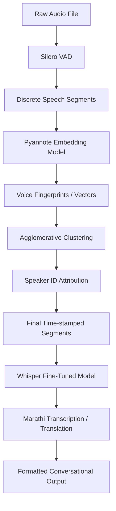

# How Audio is Converted to Time-Steps and Diarized (2026 Edition)

This document provides a detailed explanation of our high-precision speaker diarization pipeline, which has been surgically optimized for **Marathi/Indic conversational medical audio**.

## 1. What is Audio Digitization?
At its core, audio is a continuous physical wave of air pressure. When recorded, it is digitized by a microphone through a process called **sampling**. 
- **Sample Rate**: In our pipeline, we use a sample rate of `16,000 Hz` (16 kHz). This means the microphone captures 16,000 discrete amplitude values every single second.
- **Data Representation**: The audio file is loaded into Python as a massive one-dimensional mathematical array of numbers (`numpy.ndarray`). A 10-second audio clip contains 160,000 numbers.

## 2. The "VAD-First" Surgical Strategy
Standard diarization models (like Pyannote 3.1) are trained primarily on English meetings. On Marathi doctor-patient calls, they often "smooth over" rapid transitions. To solve this, we implemented a **2026-grade VAD-First pipeline**:

### A. Surgical Boundary Detection (Silero VAD)
Instead of relying on the English-centric Pyannote VAD, we use **Silero VAD**. This is a language-agnostic, deep-learning based Voice Activity Detector.
- **Precision**: It detects speech boundaries with millisecond accuracy.
- **Benefit**: It catches tiny Marathi interjections (like "Namaskar", "Ho", "Bassa") that standard models often skip.

### B. Speaker Embedding (Feature Extraction)
For every discrete speech "burst" found by Silero, we pass it through a Pyannote Embedding model.
- **The Vector**: The model converts the voice acoustics into a 512-dimensional vector (a "voice fingerprint").
- **Properties**: This fingerprint captures the timbre, pitch, and resonance of the speaker, regardless of the language they are speaking.

### C. Agglomerative Clustering (The Decision Maker)
We collect all these fingerprints and use an **Agglomerative Clustering** algorithm (with Cosine Similarity).
- **The Process**: It calculates the mathematical distance between every speech segment.
- **Constraint**: For medical consultations, we force the model to find exactly **2 clusters** (Doctor and Patient).
- **Metric**: If the "distance" between two fingerprints is small, they are grouped as the same speaker.

## 3. Post-Processing & Transcription
Once we have the surgical timestamps and speaker IDs:

1. **Turn Merging**: We merge consecutive segments from the same speaker if the gap is less than `0.5s`. This keeps the transcript readable.
2. **Whisper Transcription**: Each individual segment is sent to the fine-tuned Whisper model.
3. **Reassembly**: The resulting Marathi/English text is paired with the Speaker Label (e.g., Speaker_1 vs Speaker_2).

## Summary of the 2026 Pipeline

## Why this works for Marathi?
Traditional pipelines try to do VAD and Clustering at the same time using a single neural network. Our "Hybrid" approach separates **detection** (VAD) from **identification** (Clustering). This ensures that even if the speaker embeddings are slightly noisy due to the language accent, the **Silero VAD** guarantees we never miss the moment the speaker changes.
